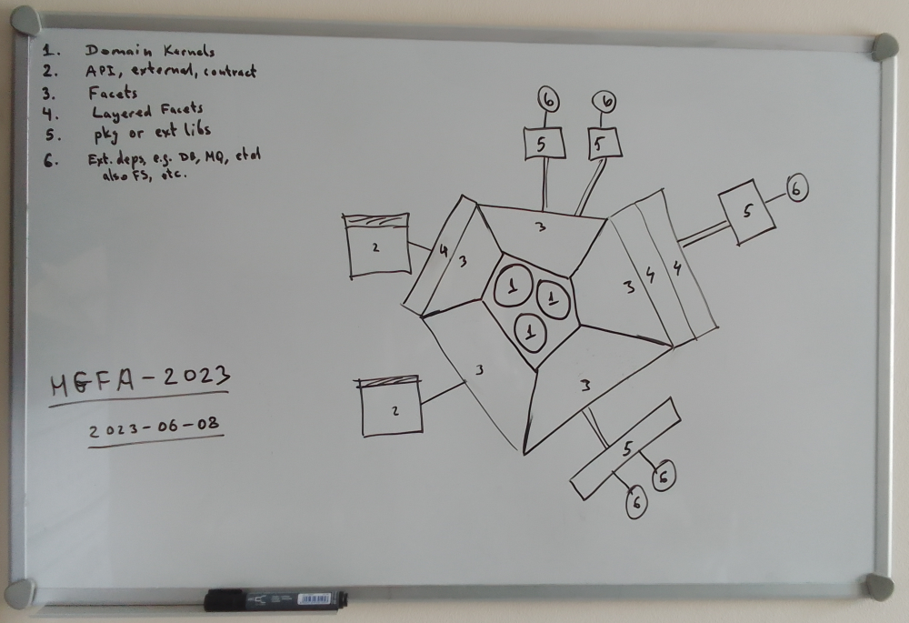

# The XU chassis and the XU concept 📦📦📦

    Spoiler: the XU is what some call "microservice" or just "service", in context of e.g. the k8s.

First, let's explain what the heck this is:

- 📦 XU, Execution Unit - the executable binary file, with all necessary artifacts and resources;
- 🧬Chassis - the reusable chunk of tech, which can be used as a chassis for an XU;
- 🚊Concept - like a "concept car" - a template ~~service~~, ~~application~~, project, XU, which can be taken as an example, to build your own XUs upon it;

Note, that like real concept cars, there can be many alternative concepts (prototypes, templates) to choose from. Maybe you can choose the one that fits you the best, or just take an inspiration from some and build your own.

Also, there's a common discussion point in Go development, how to lay out files of the project. Here are some relevant links to read on that:

- https://go.dev/doc/code
- https://go.dev/doc/modules/layout
- https://github.com/golang-standards/project-layout
- https://github.com/golang-standards/project-layout/issues/117
- https://www.reddit.com/r/golang/comments/11oh2mr/the_oneandonly_musthave_eternal_go_project_layout/
- https://appliedgo.com/blog/go-project-layout
- https://github.com/benbjohnson/wtf
- https://www.gobeyond.dev/standard-package-layout/
- https://www.gobeyond.dev/structuring-applications/
- https://www.gobeyond.dev/packages-as-layers/
- https://stackoverflow.com/questions/46646559/golang-project-directory-structure
- https://github.com/golang-standards/project-layout/issues/117 (again)
- https://eli.thegreenplace.net/2019/simple-go-project-layout-with-modules/
- https://stackoverflow.com/questions/36522643/go-lang-folder-structure-for-a-web-app


## We rather use the following layout: <br><small>(though don't take it as a dogma)</small>


- `/axu` or `/axu_<name>` - main folder for the project's XU (an "application"); The "a" is there so that this folder gets sorted on to the top; one project may have several totally different XUs.
  - `/ae` - packages, from which an executable files are built; The "a" is there so that it gets sorted up the list; easy to remember: "an executable", "an exe".
    - `/<name>`
    - `/<name>` - where the "main" function is, from which you build the executable file; if your project has CLI tools, they'll be here; if your project has single binary - it'll be here too;
  - `/core` - this is where the very main code is located; the root package of the XU, and a container for domains;
    - `/kernel.go` - a container for all XU housekeeping and all its domains and for the chassis.
      - `type Kernel struct { ... }`
    - domain_A.go
    - domain_B.go
    - domain_N.go
  - `/core-types` - put here any data types, which are integral to the XU and its domains, but you need to pass it via the DI (dependency injections) down to facets and subsystems, and avoid "circular import" errors. (Passing the Kernel struct of the `/axu/core/kernel.go` won't work, obviously).
  - `/facets` - facets, it terms of Faceted Architecture (HGFA-2023-DI);
    - `/<name>`
    - `/<name>`
- `/internal` - not used much;
- `/pub` or `/public` - general folder for any dependencies, which can potentially be useful and re-used outside of this project, in other projects;
  - `/abs` or `/abstractions` - packages which contain abstractions, both types and interfaces; (note: sometimes an abstraction can contain code, and it's up to the programmer when and if to move it elsewhere);
    - Things you should put here as well (along with Go packages):
      - OpenAPI/Swagger specs
      - JSON schema files
      - protocol definitions
      - etc.
  - `/impl` or `/implementations` - packages which contain implementations of abstractions;
  - `/pkg` - sometimes you get a package that doesn't fit in either category, then use this one;
- `/deploy` or `/deployment`
  - among other things, this is the very place to put these things, __all of them belong to the deployment/operation__:
    - DB migrations, ops, changes;
    - `.http` or `.rest` file collections, Postman collections;
    - configuration files for dev/stage/prod;
    - Docker files;
    - Env files;
    - CI/CD configs;
    - et al
- `/docs`
- `/tools` or `/utils`
- `/vendor` - optional

Other folders are unspecified.

### However, some recommendations follow:

- OpenAPI/Swagger specs, JSON schema files, protocol definitons, etc, - are all belong to `/pub/abs`.
- Configs, inits, scripts, build, also assets, website data, etc, are all belong to `/deploy` folder.
- You SHOULD NOT have an `/src` folder.
- PLEASE DON'T put your abstractions in subtrees, e.g. don't make `/models` et al - all this nicely fits into `/pub/abs/<my-something>`.

### The `axu` vs `ae`, and having several XUs in a project

Sometimes we want to build several XUs in a single project domain. Then the questions arise:

1. Should we put them in the `/axu/ae`?
2. What if they are different, and need to have very different core and facets?

The answer is this:

1. An XU may be built into different executable files - sometimes that's useful - in that case they all share the same core and facets, and their mains are put into the `/axu/ae/<some>`;
2. One project may have several totally different XUs, which don't share the core and facets, have their own, and share only the `/pub`, as if they were in different projects. In that case, you create several `/axu` folders, by the pattern `/axu_<name>`.

Here's an example of a project with a single XU with several options to build executable files, or several XUs sharing the same core:

```
    axu/
      ae/
        cmd1/
        cmdN/
      core/
      core-types/
      facets/
```

Here's an example of a project with several XUs, not sharing anything but `/pub`:

```
    axu_MyOne/
      ae/
        cmd1/
        cmdN/
      core/
      core-types/
      facets/

    axu_MyTwo/
      ae/
        cmd1/
        cmdN/
      core/
      core-types/
      facets/
```

## The architecture of the XU 

### The XU has:

- Domains
- Facets
- Subsystems

Their scope and definitions may overlap.

The __domain__ is the business/application/whatever logic, or any other distinct aspect of the XU.
The canonical microservice is expected to have exactly __one__ domain, but more complex ones may have
several. All domains are located inside the `/axu/core` package, all in a single package. See below for more
on this.

The __facet__ is a package that implements some functionality or wraps something (e.g. the databse), which is integral to the XU, non-shareable to other projects (or else it should be in the `/pub` folder), but too big to be put directly
into the __core__. 

The __subsystem__ is a runtime concept, which means any semi-autonomous or autonomous system, running inside
the XU. Examples might be Prometheus metrics, pprof, background workers of caches, reconnect loops, supervision trees, et al.

Note, that the subsystem term is orthogonal to the structure of the code, and it can be implemented in any
location of the project.

Unfortunatelly, we can not structure the domains as sub-folders, as sub-packages, because the Go language mandates
the "one folder - one package", and all domains are required to reside in a single package. The Go
language prohibits circular imports, and we need all our domains have free access to each other, live in a single, well, "domain"... that's why.

If you have some domain that does not need any cross-access to other domains, then this is a sign this is not
a domain at all, and rather a facet - and so it can be moved to `/axu/facets/your-thing`.

Sometimes the __core__ has a lot of files, and to overcome the Go's limitation on a package reside completely in a single folder and not span several sub-folders, you can use prefixes to files, to emulate the hierarchy, like this:

```
    axu/
      ae/
      core/
        kernel.go
        main-... .go
        main-... .go
        domainA-... .go
        domainA-... .go
        domainA-... .go
        domainA-... .go
        domainB-... .go
        domainB-... .go
        domainB-... .go
        domainC-... .go
      core-types/
      facets/
```

### The Kernel

The core's core, the struct that contains the main context of the XU, we call it the __Kernel__.

It's normally put into the `/axu/core/kernel.go` file. The Kernel normally is a container for all XU housekeeping and all its domains and for the chassis.

In the above, there are main-*.go files - the "main" here is just another domain, but more often then not it is normally present in the XU. These are not the `main()` funcs, as found in the `/axu/ae/<name>`.

### Let's see it:




## The Chassis. (What?)

What is the chassis? Something like this for a car:


As it turns out, most of the XUs tend to have and use the very similar basic setup - like loading the config,
initializing a logger, etc. Instead of constantly copying this boilerplate code, it is put in a separate library package,
so you can insert it into the kernel of every XU's kernel.

The file `/axu/core/kernel.go`:

```go
  package core

  import "github.com/rusriver/nutz/xu/chassis"

  type Kernel struct {
    Chassis *chassis.Chassis

    // all other housekeeping and domains and/or subsystems of the XU
  }
```

Further info on the chassis see in the `/xu/chassis/README.md` file.

## XU Concepts (example prototypes)

### ⮑ `concept01/C1` and `concept01/C2` 💾📌

These are the basic concepts of the XU, the simplest ones, which can be looked at the first.

The `concept01/C1` uses the free-form config, and the `concept01/C2` uses the structural config.

Both provide:
- HTTP GET /ping handle
- gRPC ping method
- simple connection to a MongoDB database

Feel comfortable to dig inside their source code and explore them.

### ⮑ `concept02` 💾📌

### ⮑ `concept03` 💾📌


